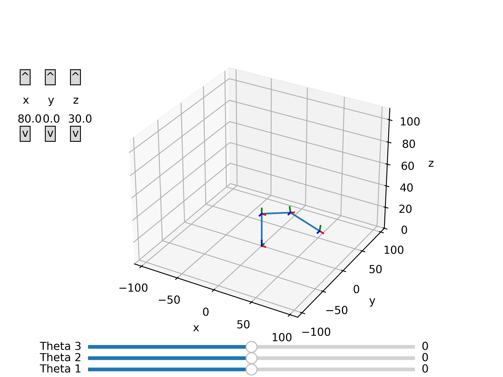

# Robot Arm Kinematics Simulation

Matplotlib based robot arm kinematics simulation. Allows for control of both the end-effector position and orientation, with updates done via inverse kinematics, and control of individual joint angles, with updates done via forward kinematics.

Multiple arms can be simulated. Currently, the elbow manipulator (3 revolute joints) and the 6DOF manipulator (6 revolute joints) are available. I am working on adding a 5DOF (5 revolute joints) arm.

Here is a demonstration of inverse kinematics in action on the 6DOF manipulator:

And a similar demonstration on the elbow manipulator:

# Running

`python3 main.py`
