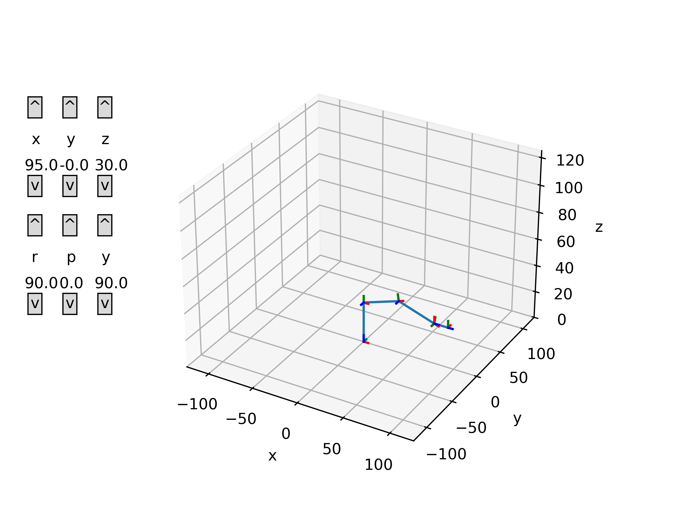

# Robot Arm Kinematics Simulation

Matplotlib based robot arm kinematics simulation. Allows for control of both the end-effector position and orientation (for robots that support this), with updates done via inverse kinematics, and control of individual joint angles, with updates done via forward kinematics.

Multiple arms can be simulated. The three choices are: the elbow manipulator (3 revolute joints), the 6DOF manipulator (the elbow manipulator + a spherical wrist), and the 5DOF manipulator (the 6DOF manipulator with the 4th revolute joint removed - this removes the ability to yaw the end end-effector independently of the base angle).

Here is a demonstration of inverse kinematics in action on the 6DOF manipulator:

And a similar demonstration on the 5DOF manipulator:

# Running

`python3 main.py`
